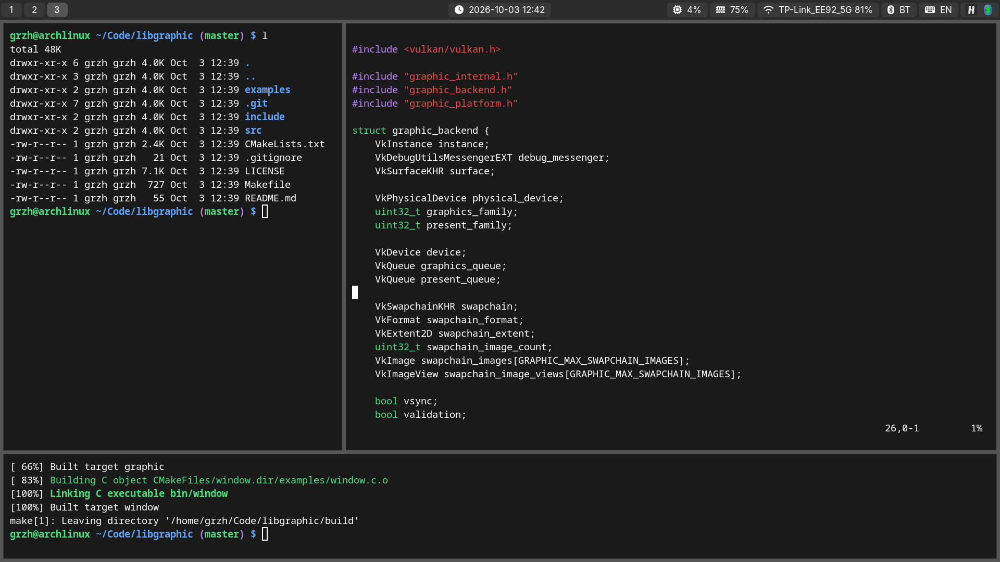
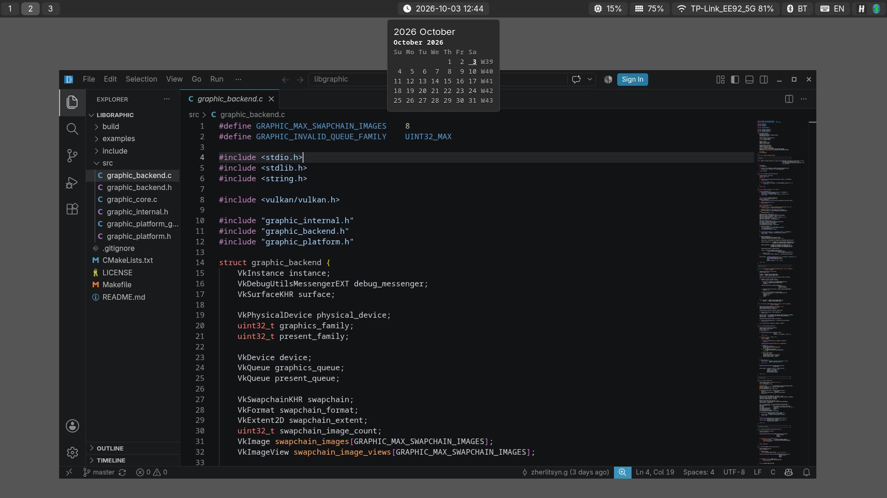
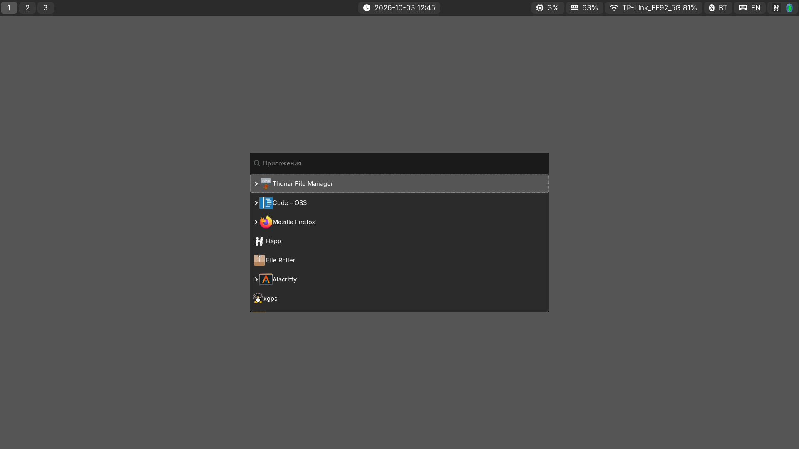
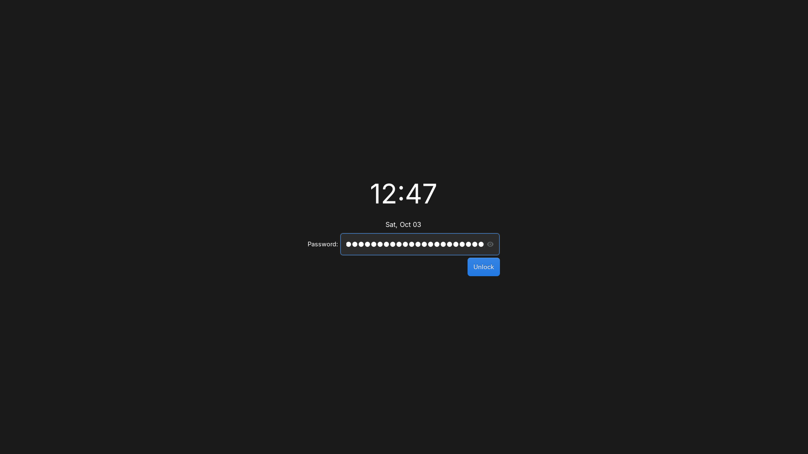

# Sway Dotfiles

A minimalist laptop-oriented environment built on **Sway + Waybar** (Arch Linux).
Gray theme with no accent color;

Components: Sway (WM) · Waybar (panel) · Wofi (launcher) · Alacritty (terminal) ·
Mako (notifications) · gtklock (lock screen) · Thunar (files) · File Roller (archives) 
Code — OSS · Firefox.

## Screenshots


*Desktop: Waybar panel, borderless tiling*


*Floating window with a titlebar + clock calendar tooltip*


*Wofi launcher*


*gtklock lock screen with clock*

## Files stored in this repository

| Path in repo                    | Deployed to                                   | Purpose |
|---------------------------------|-----------------------------------------------|---------|
| `config/sway/config`            | `~/.config/sway/config`                       | WM config: hotkeys (bindcode — layout-independent), borders, autostart, idle/sleep lock via swayidle + gtklock |
| `config/sway/scripts/floating-border.sh` | `~/.config/sway/scripts/floating-border.sh` | Float toggle with correct border style; exceptions: Code/Firefox → `border pixel 0` |
| `config/waybar/config`          | `~/.config/waybar/config`                     | Panel modules: workspaces, mode, clock+calendar, CPU, RAM, WiFi, BT, layout, tray |
| `config/waybar/style.css`       | `~/.config/waybar/style.css`                  | Gray panel theme, rounded corners, insets from panel edges |
| `config/waybar/scripts/net.sh`  | `~/.config/waybar/scripts/net.sh`             | Network indicator via nmcli |
| `config/waybar/scripts/lang.sh` | `~/.config/waybar/scripts/lang.sh`            | Keyboard layout indicator (EN/RU) via swaymsg+jq |
| `config/wofi/config`            | `~/.config/wofi/config`                       | Launcher (drun) |
| `config/wofi/style.css`         | `~/.config/wofi/style.css`                    | Launcher theme |
| `config/alacritty/alacritty.toml` | `~/.config/alacritty/alacritty.toml`        | Terminal: gray palette, font |
| `config/mako/config`            | `~/.config/mako/config`                       | Notifications |
| `config/gtklock/config.ini`     | `~/.config/gtklock/config.ini`                | Lock screen: dark GTK theme, time module, style path |
| `config/gtklock/style.css`      | `~/.config/gtklock/style.css`                 | Lock screen gray theme: clock, password field, buttons |
| `config/environment.d/30-wayland.conf` | `~/.config/environment.d/30-wayland.conf` | Wayland for Firefox/Electron/Qt (fixes blurriness and XWayland fallback) |
| `install.sh`                    | —                                             | Copies the configs into place |

## Repository layout

```
.
├── README.md
├── install.sh
├── screenshots/
│   ├── 01-desktop.png
│   ├── 02-floating.png
│   ├── 03-wofi.png
│   └── 04-lock.png
└── config/
    ├── sway/
    │   ├── config
    │   └── scripts/
    │       └── floating-border.sh
    ├── waybar/
    │   ├── config
    │   ├── style.css
    │   └── scripts/
    │       ├── net.sh
    │       └── lang.sh
    ├── wofi/
    │   ├── config
    │   └── style.css
    ├── alacritty/
    │   └── alacritty.toml
    ├── mako/
    │   └── config
    ├── gtklock/
    │   ├── config.ini
    │   └── style.css
    └── environment.d/
        └── 30-wayland.conf
```

## Installing packages (Arch Linux)

Official repositories:

```bash
sudo pacman -S --needed \
  sway waybar alacritty wofi jq \
  thunar gvfs tumbler thunar-archive-plugin file-roller \
  zip unzip p7zip xz zstd tar gzip bzip2 unar \
  networkmanager network-manager-applet \
  bluez bluez-utils blueman \
  pipewire pipewire-pulse pipewire-alsa wireplumber pavucontrol playerctl \
  mako grim slurp wl-clipboard brightnessctl \
  swayidle polkit-gnome xorg-xwayland \
  inter-font ttf-dejavu noto-fonts-emoji \
  firefox code-oss git gtklock
```

AUR (`yay`/`paru` required) — Font Awesome icons for the panel:

```bash
yay -S otf-font-awesome
```

Optional:

```bash
sudo pacman -S --needed xdg-desktop-portal-wlr xdg-desktop-portal-gtk qt6-wayland vim
# swaylock as an emergency fallback lockscreen (not used by default):
sudo pacman -S --needed swaylock
```

Services:

```bash
sudo systemctl enable --now NetworkManager bluetooth
```

## Installing the configs

```bash
git clone https://github.com/zherlitsyn/sway-dots.git
cd sway-dots
./install.sh
```

`install.sh`:

```bash
#!/usr/bin/env bash
set -euo pipefail
ROOT="$(cd "$(dirname "$0")" && pwd)"
XDG="${XDG_CONFIG_HOME:-$HOME/.config}"

for d in sway waybar wofi alacritty mako gtklock; do
    mkdir -p "$XDG/$d"
    cp -r "$ROOT/config/$d/." "$XDG/$d/"
done

mkdir -p "$XDG/environment.d"
cp "$ROOT/config/environment.d/30-wayland.conf" "$XDG/environment.d/"

chmod +x "$XDG/sway/scripts/floating-border.sh" \
         "$XDG/waybar/scripts/net.sh" \
         "$XDG/waybar/scripts/lang.sh"

echo "Done. Log out and log back in (environment.d, swayidle)."
```

> After modifying `environment.d/30-wayland.conf` a **full re-login** is
> required — these variables are read at user session start. The swayidle
> lock commands (gtklock) also pick up only after re-login.

## Keybindings

`Mod` = Super. Letter bindings use `bindcode`, so they work in both US and RU layouts.

| Keys | Action |
|---|---|
| `Mod+Return` | Terminal (Alacritty) |
| `Mod+d` | Launcher (Wofi) |
| `Mod+e` | File manager (Thunar) |
| `Mod+Shift+q` | Kill focused window |
| `Mod+Shift+c` / `Mod+Shift+e` | Reload config / exit session |
| `Mod+Shift+x` | Lock screen (gtklock) |
| `Mod+Shift+Space` | Float ↔ tiling (with correct border style; Code/Firefox — borderless) |
| `Mod+1..0` / `Mod+Shift+1..0` | Switch workspace / move window to workspace |
| `Mod+h/j/k/l` + arrows | Focus; with `Shift` — move window |
| `Mod+b` / `Mod+v` | Horizontal / vertical split |
| `Mod+s` / `Mod+w` / `Mod+t` | stacking / tabbed / toggle split |
| `Mod+f` | Fullscreen |
| `Mod+a` | Focus parent container |
| `Mod+Shift+minus` / `Mod+minus` | Move to scratchpad / show from scratchpad |
| `Mod+r` | Resize mode (`h/j/k/l`, exit — `Esc`/`Return`) |
| `XF86Audio*` | Volume/mic/player (work on the lock screen) |
| `XF86MonBrightness*` | Brightness |
| `Print` / `Shift+Print` / `Mod+Print` | Screenshot: full screen to clipboard / region to clipboard / region to file |

Mouse: `Mod+LMB` — drag window, `Mod+RMB` — resize; touchpad: tap, dwt.
